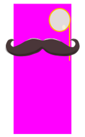

# Placeholder climb


The game was created as a part of the game jam: https://itch.io/jam/kodsnacks-2veckorssylt.
Around the theme of mustasch and platformer. It is created using the game engine: löve/love2d


## The Game
You are a placeholder block on the run from the pesky developers trying to delete you. The clever disguise have failed and your only option is to get higher up in the stack.

The game is a endless climber. Get as high as possible to get that sweet sweet highscore!

Link to game: https://fronkan.itch.io/kodsnack2weekjam


## Running the game
If you are using windows you can download the game on itch.io, https://fronkan.itch.io/kodsnack2weekjam. And if you are not you can run it using the löve/love2d game engine. Then you can either download the .love file from itch or just clone this repo and standing where you cloned it run:
```
love placeholder_climb
```
or if you downloaded the .love file:
```
love placeholder_climb.love
```

